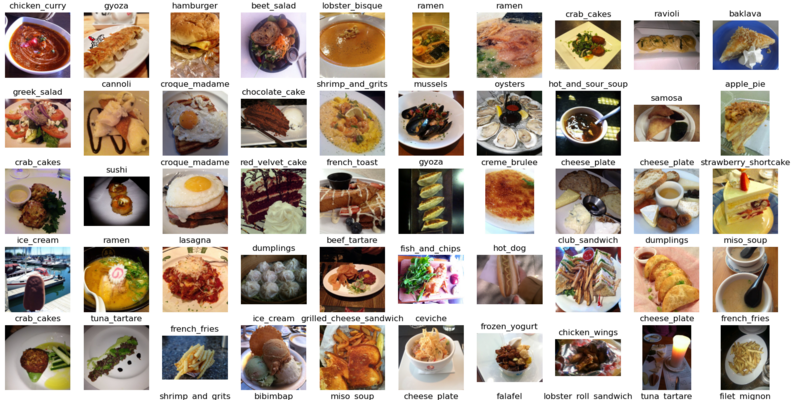
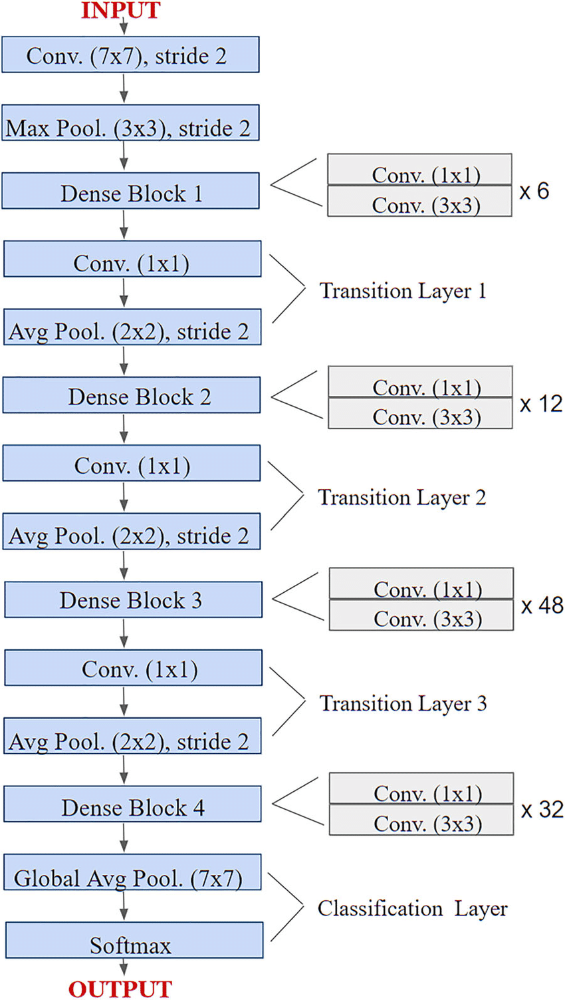

# <center><i>Prasunet Company Machine Learning Project - 05</i></center>

<center></center>

## Problem Statement

### Background
- In today's fast-paced world, maintaining a healthy diet is a significant challenge for many individuals. Accurate dietary tracking is essential for weight management, disease prevention, and overall well-being. However, manual logging of food items and their calorie content can be tedious, time-consuming, and prone to errors. There is a need for an automated system that can simplify this process by recognizing food items from images and estimating their calorie content accurately.

### Objective
- The objective of this project is to develop a machine learning model that can:

- <u>Recognize Food Items from Images</u> : Accurately identify a wide variety of food items from photographs taken by users.
- <u>Estimate Calorie Content</u> : Provide an accurate estimate of the calorie content for the recognized food items.
<br>

## About the Dataset 📊

- Download the dataset from here: [Dataset Download](https://www.kaggle.com/datasets/dansbecker/food-101/data)

- It contains images of food, organized by type of food. It was used in the Paper "Food-101 – Mining Discriminative Components with Random Forests" by Lukas Bossard, Matthieu Guillaumin and Luc Van Gool. It's a good (large dataset) for testing computer vision techniques.

- This Dataset contains 101 types of food, each category having 1000 images.

<br>

## Fine Tuning Pretrained Model - DenseNet201 🚀

### Architecture

<center></center>

<br>

## Model Evaluation 🤖

### <center><i>Training and Validation Data Performance</i> 📈</center>
<center></center>

<br>

## How to Set Up This Project 🛠️

This guide walks you through setting up the project's environment.

**1. Install Python 🐍**

If you don't have Python installed yet, head over to the official download page: [Python Download Guide](https://wiki.python.org/moin/BeginnersGuide/Download) and follow the instructions for your operating system (Windows, macOS, or Linux).

**<u>Optional: Creating a Virtual Environment</u>**

1. Install virtualenv (if not already installed):

   - If you haven't installed virtualenv, you can do so using pip:
    ```bash
    pip install virtualenv
    ```
2. Create a virtual environment:

    - In the terminal and run this command:
    ``` bash
    virtualenv venv
    ```

3.  Activate the virtual environment:

    - To activate the virtual environment:
    ``` bash
    venv\Scripts\activate
    ```


**2. Download the Repo 📥**


1. Open your Git client or terminal.
2. Navigate to the directory where you want to clone the repository.
3. Run the following command, replacing `<repository_url>` with the actual URL of the project's repository:

```bash 
git clone <repository_url>
```

**3. Install required Dependencies  📦**
1. Open terminal/cmd.
2. Navigate to repo directory
3. Run the following command to install dependencies from requirements.txt:

``` bash
pip install -r requirements.txt
```

**4. Host the project Locally 🌐**

- After installing the required dependencies, run the following command to start the project locally:

``` bash
streamlit run server.py
```

